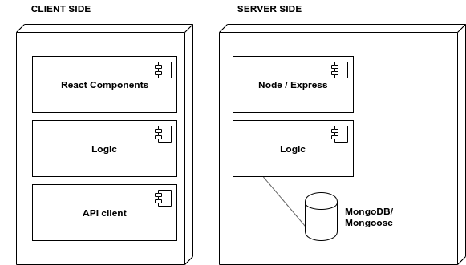
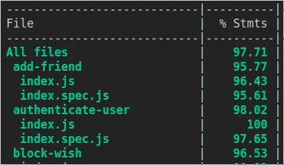

# WiShare

## Introduction

Tired of having to think what to give and then not like it? 

With WiShare that torment is over. Through this application you can create wish lists so that any of your network can see what gifts you would like to receive as well as, you can visit the profile of your friends to see their wish list and be able to choose the best gift, you can also save it in the "Pending Wishes" list so you don't lose it and have all the information at hand. 
You can also connect to your friend's ChatRoom where all their friends will be, so you can coordinate when buying a gift, share expenses, give surprises, etc.

You can run the demo(mobile version) [here](https://wishare-app.herokuapp.com/#/)

## Functional Description

Users can:
- Register, login and logout
- Modify profile, add image profile
- Create, edit, update and delete a wish
- Wish owner can mark their wishes as received
- User can block wishes from his friends so that others see that it is reserved
- Search users by email 
- Add users to friends
- Delete users from friends
- View users profile and save users wishes 
- Go to friend's chatroom and talk to their friends

### Use Cases

### Flow

## Technical Description

### Blocks

### Data Model

## Technologies

Javascript, ReactJS, Node.js, Express, MongoDB & Mongoose, 
HTML5, SASS, CSS3. 

## Code Coverage

## TODO

- Friends Request
- Private WishList
- Delete account
- Desktop design
